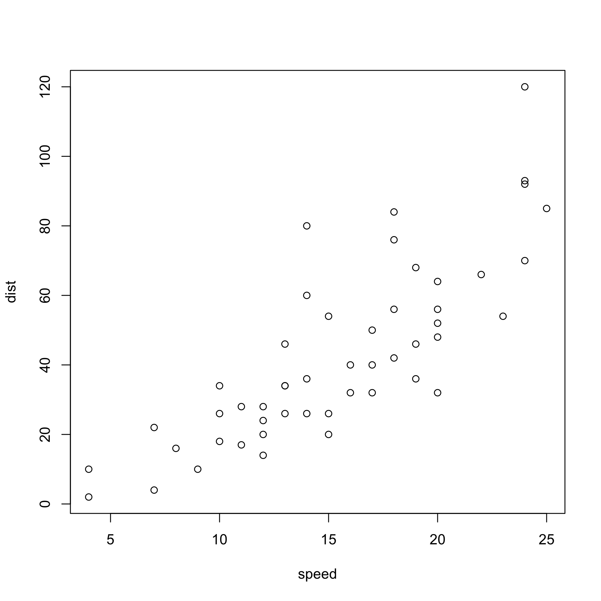
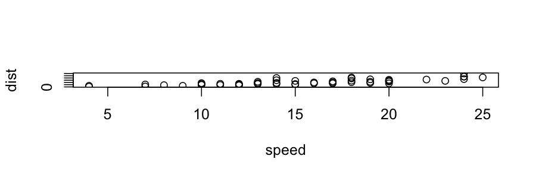
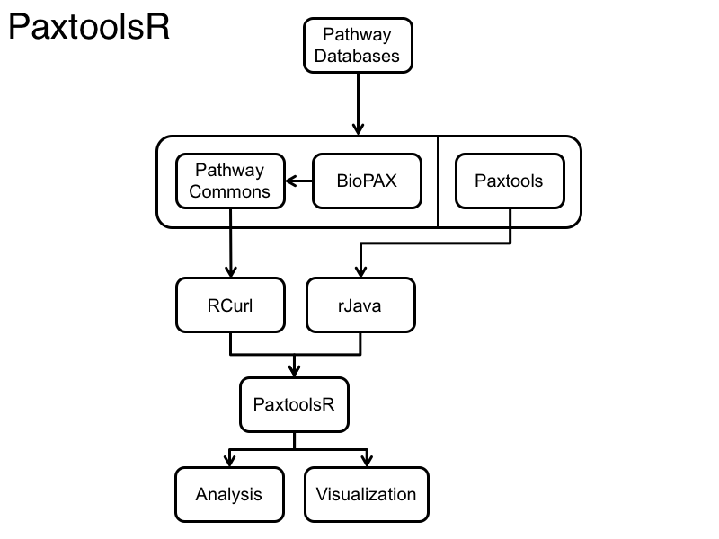

Backup
====
author: Augustin Luna (lunaa@jimmy.harvard.edu)
date: University of Sao Paulo, 09 January, 2016
width: 960
height: 700
css: rpres.css

<div class="guide horz" style="height: 0%; width: 100%; top: 10%; left: 0%"></div>
<div class="guide horz" style="height: 0%; width: 100%; top: 20%; left: 0%"></div>
<div class="guide horz" style="height: 0%; width: 100%; top: 30%; left: 0%"></div>
<div class="guide horz" style="height: 0%; width: 100%; top: 40%; left: 0%"></div>
<div class="guide horz" style="height: 0%; width: 100%; top: 50%; left: 0%"></div>
<div class="guide horz" style="height: 0%; width: 100%; top: 60%; left: 0%"></div>
<div class="guide horz" style="height: 0%; width: 100%; top: 70%; left: 0%"></div>
<div class="guide horz" style="height: 0%; width: 100%; top: 80%; left: 0%"></div>
<div class="guide horz" style="height: 0%; width: 100%; top: 90%; left: 0%"></div>

<div class="guide vert" style="height: 100%; width: 0%; top: 0%; left: 10%"></div>
<div class="guide vert" style="height: 100%; width: 0%; top: 0%; left: 20%"></div>
<div class="guide vert" style="height: 100%; width: 0%; top: 0%; left: 30%"></div>
<div class="guide vert" style="height: 100%; width: 0%; top: 0%; left: 40%"></div>
<div class="guide vert" style="height: 100%; width: 0%; top: 0%; left: 50%"></div>
<div class="guide vert" style="height: 100%; width: 0%; top: 0%; left: 60%"></div>
<div class="guide vert" style="height: 100%; width: 0%; top: 0%; left: 70%"></div>
<div class="guide vert" style="height: 100%; width: 0%; top: 0%; left: 80%"></div>
<div class="guide vert" style="height: 100%; width: 0%; top: 0%; left: 90%"></div>


<div class="footer"></div>

Scree Test
====

<div class="guide horz" style="height: 0%; width: 100%; top: 10%; left: 0%"></div>
<div class="guide horz" style="height: 0%; width: 100%; top: 20%; left: 0%"></div>
<div class="guide horz" style="height: 0%; width: 100%; top: 30%; left: 0%"></div>
<div class="guide horz" style="height: 0%; width: 100%; top: 40%; left: 0%"></div>
<div class="guide horz" style="height: 0%; width: 100%; top: 50%; left: 0%"></div>
<div class="guide horz" style="height: 0%; width: 100%; top: 60%; left: 0%"></div>
<div class="guide horz" style="height: 0%; width: 100%; top: 70%; left: 0%"></div>
<div class="guide horz" style="height: 0%; width: 100%; top: 80%; left: 0%"></div>
<div class="guide horz" style="height: 0%; width: 100%; top: 90%; left: 0%"></div>

<div class="guide vert" style="height: 100%; width: 0%; top: 0%; left: 10%"></div>
<div class="guide vert" style="height: 100%; width: 0%; top: 0%; left: 20%"></div>
<div class="guide vert" style="height: 100%; width: 0%; top: 0%; left: 30%"></div>
<div class="guide vert" style="height: 100%; width: 0%; top: 0%; left: 40%"></div>
<div class="guide vert" style="height: 100%; width: 0%; top: 0%; left: 50%"></div>
<div class="guide vert" style="height: 100%; width: 0%; top: 0%; left: 60%"></div>
<div class="guide vert" style="height: 100%; width: 0%; top: 0%; left: 70%"></div>
<div class="guide vert" style="height: 100%; width: 0%; top: 0%; left: 80%"></div>
<div class="guide vert" style="height: 100%; width: 0%; top: 0%; left: 90%"></div>

eu

Hierarchical Clustering: Basic Algorithm
====

<div class="guide horz" style="height: 0%; width: 100%; top: 10%; left: 0%"></div>
<div class="guide horz" style="height: 0%; width: 100%; top: 20%; left: 0%"></div>
<div class="guide horz" style="height: 0%; width: 100%; top: 30%; left: 0%"></div>
<div class="guide horz" style="height: 0%; width: 100%; top: 40%; left: 0%"></div>
<div class="guide horz" style="height: 0%; width: 100%; top: 50%; left: 0%"></div>
<div class="guide horz" style="height: 0%; width: 100%; top: 60%; left: 0%"></div>
<div class="guide horz" style="height: 0%; width: 100%; top: 70%; left: 0%"></div>
<div class="guide horz" style="height: 0%; width: 100%; top: 80%; left: 0%"></div>
<div class="guide horz" style="height: 0%; width: 100%; top: 90%; left: 0%"></div>

<div class="guide vert" style="height: 100%; width: 0%; top: 0%; left: 10%"></div>
<div class="guide vert" style="height: 100%; width: 0%; top: 0%; left: 20%"></div>
<div class="guide vert" style="height: 100%; width: 0%; top: 0%; left: 30%"></div>
<div class="guide vert" style="height: 100%; width: 0%; top: 0%; left: 40%"></div>
<div class="guide vert" style="height: 100%; width: 0%; top: 0%; left: 50%"></div>
<div class="guide vert" style="height: 100%; width: 0%; top: 0%; left: 60%"></div>
<div class="guide vert" style="height: 100%; width: 0%; top: 0%; left: 70%"></div>
<div class="guide vert" style="height: 100%; width: 0%; top: 0%; left: 80%"></div>
<div class="guide vert" style="height: 100%; width: 0%; top: 0%; left: 90%"></div>

* Hierarchical Clustering can be agglomerative (bottom up) or divise (top down)
* Agglomerative: 
 1. The two nearest nodes are merged into a single node 
* Divise: Similiar to agglomerative but in reverse

Hierarchical Clustering and Linkage
====

<div class="guide horz" style="height: 0%; width: 100%; top: 10%; left: 0%"></div>
<div class="guide horz" style="height: 0%; width: 100%; top: 20%; left: 0%"></div>
<div class="guide horz" style="height: 0%; width: 100%; top: 30%; left: 0%"></div>
<div class="guide horz" style="height: 0%; width: 100%; top: 40%; left: 0%"></div>
<div class="guide horz" style="height: 0%; width: 100%; top: 50%; left: 0%"></div>
<div class="guide horz" style="height: 0%; width: 100%; top: 60%; left: 0%"></div>
<div class="guide horz" style="height: 0%; width: 100%; top: 70%; left: 0%"></div>
<div class="guide horz" style="height: 0%; width: 100%; top: 80%; left: 0%"></div>
<div class="guide horz" style="height: 0%; width: 100%; top: 90%; left: 0%"></div>

<div class="guide vert" style="height: 100%; width: 0%; top: 0%; left: 10%"></div>
<div class="guide vert" style="height: 100%; width: 0%; top: 0%; left: 20%"></div>
<div class="guide vert" style="height: 100%; width: 0%; top: 0%; left: 30%"></div>
<div class="guide vert" style="height: 100%; width: 0%; top: 0%; left: 40%"></div>
<div class="guide vert" style="height: 100%; width: 0%; top: 0%; left: 50%"></div>
<div class="guide vert" style="height: 100%; width: 0%; top: 0%; left: 60%"></div>
<div class="guide vert" style="height: 100%; width: 0%; top: 0%; left: 70%"></div>
<div class="guide vert" style="height: 100%; width: 0%; top: 0%; left: 80%"></div>
<div class="guide vert" style="height: 100%; width: 0%; top: 0%; left: 90%"></div>

* eetouh
* Options of Cluster Linkage Distances
 * Single: Distance between clusters is defined by the distance between the two closest points. 
 * Average: Distance 
 * Complete: 
* hclust() in R uses the "complete" method by default

Code Only Slide
====

<div class="guide horz" style="height: 0%; width: 100%; top: 10%; left: 0%"></div>
<div class="guide horz" style="height: 0%; width: 100%; top: 20%; left: 0%"></div>
<div class="guide horz" style="height: 0%; width: 100%; top: 30%; left: 0%"></div>
<div class="guide horz" style="height: 0%; width: 100%; top: 40%; left: 0%"></div>
<div class="guide horz" style="height: 0%; width: 100%; top: 50%; left: 0%"></div>
<div class="guide horz" style="height: 0%; width: 100%; top: 60%; left: 0%"></div>
<div class="guide horz" style="height: 0%; width: 100%; top: 70%; left: 0%"></div>
<div class="guide horz" style="height: 0%; width: 100%; top: 80%; left: 0%"></div>
<div class="guide horz" style="height: 0%; width: 100%; top: 90%; left: 0%"></div>

<div class="guide vert" style="height: 100%; width: 0%; top: 0%; left: 10%"></div>
<div class="guide vert" style="height: 100%; width: 0%; top: 0%; left: 20%"></div>
<div class="guide vert" style="height: 100%; width: 0%; top: 0%; left: 30%"></div>
<div class="guide vert" style="height: 100%; width: 0%; top: 0%; left: 40%"></div>
<div class="guide vert" style="height: 100%; width: 0%; top: 0%; left: 50%"></div>
<div class="guide vert" style="height: 100%; width: 0%; top: 0%; left: 60%"></div>
<div class="guide vert" style="height: 100%; width: 0%; top: 0%; left: 70%"></div>
<div class="guide vert" style="height: 100%; width: 0%; top: 0%; left: 80%"></div>
<div class="guide vert" style="height: 100%; width: 0%; top: 0%; left: 90%"></div>


```r
summary(cars)
predict(model, newdata=data.frame(Units=4))
predict(model, newdata=data.frame(Units=4), interval = "pred")
predict(model, newdata=data.frame(Units=4), interval = "confidence")
```

Plot Only
====

<div class="guide horz" style="height: 0%; width: 100%; top: 10%; left: 0%"></div>
<div class="guide horz" style="height: 0%; width: 100%; top: 20%; left: 0%"></div>
<div class="guide horz" style="height: 0%; width: 100%; top: 30%; left: 0%"></div>
<div class="guide horz" style="height: 0%; width: 100%; top: 40%; left: 0%"></div>
<div class="guide horz" style="height: 0%; width: 100%; top: 50%; left: 0%"></div>
<div class="guide horz" style="height: 0%; width: 100%; top: 60%; left: 0%"></div>
<div class="guide horz" style="height: 0%; width: 100%; top: 70%; left: 0%"></div>
<div class="guide horz" style="height: 0%; width: 100%; top: 80%; left: 0%"></div>
<div class="guide horz" style="height: 0%; width: 100%; top: 90%; left: 0%"></div>

<div class="guide vert" style="height: 100%; width: 0%; top: 0%; left: 10%"></div>
<div class="guide vert" style="height: 100%; width: 0%; top: 0%; left: 20%"></div>
<div class="guide vert" style="height: 100%; width: 0%; top: 0%; left: 30%"></div>
<div class="guide vert" style="height: 100%; width: 0%; top: 0%; left: 40%"></div>
<div class="guide vert" style="height: 100%; width: 0%; top: 0%; left: 50%"></div>
<div class="guide vert" style="height: 100%; width: 0%; top: 0%; left: 60%"></div>
<div class="guide vert" style="height: 100%; width: 0%; top: 0%; left: 70%"></div>
<div class="guide vert" style="height: 100%; width: 0%; top: 0%; left: 80%"></div>
<div class="guide vert" style="height: 100%; width: 0%; top: 0%; left: 90%"></div>




<div class="box" style="height: 10%; width: 10%; top: 30%; left: 50%">
  <span class="filled" style="font-size: 1rem !important">Hello<span>
</div>

Output Only Slide
====

<div class="guide horz" style="height: 0%; width: 100%; top: 10%; left: 0%"></div>
<div class="guide horz" style="height: 0%; width: 100%; top: 20%; left: 0%"></div>
<div class="guide horz" style="height: 0%; width: 100%; top: 30%; left: 0%"></div>
<div class="guide horz" style="height: 0%; width: 100%; top: 40%; left: 0%"></div>
<div class="guide horz" style="height: 0%; width: 100%; top: 50%; left: 0%"></div>
<div class="guide horz" style="height: 0%; width: 100%; top: 60%; left: 0%"></div>
<div class="guide horz" style="height: 0%; width: 100%; top: 70%; left: 0%"></div>
<div class="guide horz" style="height: 0%; width: 100%; top: 80%; left: 0%"></div>
<div class="guide horz" style="height: 0%; width: 100%; top: 90%; left: 0%"></div>

<div class="guide vert" style="height: 100%; width: 0%; top: 0%; left: 10%"></div>
<div class="guide vert" style="height: 100%; width: 0%; top: 0%; left: 20%"></div>
<div class="guide vert" style="height: 100%; width: 0%; top: 0%; left: 30%"></div>
<div class="guide vert" style="height: 100%; width: 0%; top: 0%; left: 40%"></div>
<div class="guide vert" style="height: 100%; width: 0%; top: 0%; left: 50%"></div>
<div class="guide vert" style="height: 100%; width: 0%; top: 0%; left: 60%"></div>
<div class="guide vert" style="height: 100%; width: 0%; top: 0%; left: 70%"></div>
<div class="guide vert" style="height: 100%; width: 0%; top: 0%; left: 80%"></div>
<div class="guide vert" style="height: 100%; width: 0%; top: 0%; left: 90%"></div>


| Right | Left | Default | Center |
|------:|:-----|---------|:------:|
| 12 | 12 | 12 | 12 |
| 123 | 123 | 123 | 123 |
| 1 | 1 | 1 | 1 |


```
     speed           dist       
 Min.   : 4.0   Min.   :  2.00  
 1st Qu.:12.0   1st Qu.: 26.00  
 Median :15.0   Median : 36.00  
 Mean   :15.4   Mean   : 42.98  
 3rd Qu.:19.0   3rd Qu.: 56.00  
 Max.   :25.0   Max.   :120.00  
```

Slide With Image Left
====

<div class="guide horz" style="height: 0%; width: 100%; top: 10%; left: 0%"></div>
<div class="guide horz" style="height: 0%; width: 100%; top: 20%; left: 0%"></div>
<div class="guide horz" style="height: 0%; width: 100%; top: 30%; left: 0%"></div>
<div class="guide horz" style="height: 0%; width: 100%; top: 40%; left: 0%"></div>
<div class="guide horz" style="height: 0%; width: 100%; top: 50%; left: 0%"></div>
<div class="guide horz" style="height: 0%; width: 100%; top: 60%; left: 0%"></div>
<div class="guide horz" style="height: 0%; width: 100%; top: 70%; left: 0%"></div>
<div class="guide horz" style="height: 0%; width: 100%; top: 80%; left: 0%"></div>
<div class="guide horz" style="height: 0%; width: 100%; top: 90%; left: 0%"></div>

<div class="guide vert" style="height: 100%; width: 0%; top: 0%; left: 10%"></div>
<div class="guide vert" style="height: 100%; width: 0%; top: 0%; left: 20%"></div>
<div class="guide vert" style="height: 100%; width: 0%; top: 0%; left: 30%"></div>
<div class="guide vert" style="height: 100%; width: 0%; top: 0%; left: 40%"></div>
<div class="guide vert" style="height: 100%; width: 0%; top: 0%; left: 50%"></div>
<div class="guide vert" style="height: 100%; width: 0%; top: 0%; left: 60%"></div>
<div class="guide vert" style="height: 100%; width: 0%; top: 0%; left: 70%"></div>
<div class="guide vert" style="height: 100%; width: 0%; top: 0%; left: 80%"></div>
<div class="guide vert" style="height: 100%; width: 0%; top: 0%; left: 90%"></div>


***

The equation is $\frac{1}{n} \sum_{i=i}^{n} x_{i}$


Two-Column Slide
====
left: 70%

<div class="guide horz" style="height: 0%; width: 100%; top: 10%; left: 0%"></div>
<div class="guide horz" style="height: 0%; width: 100%; top: 20%; left: 0%"></div>
<div class="guide horz" style="height: 0%; width: 100%; top: 30%; left: 0%"></div>
<div class="guide horz" style="height: 0%; width: 100%; top: 40%; left: 0%"></div>
<div class="guide horz" style="height: 0%; width: 100%; top: 50%; left: 0%"></div>
<div class="guide horz" style="height: 0%; width: 100%; top: 60%; left: 0%"></div>
<div class="guide horz" style="height: 0%; width: 100%; top: 70%; left: 0%"></div>
<div class="guide horz" style="height: 0%; width: 100%; top: 80%; left: 0%"></div>
<div class="guide horz" style="height: 0%; width: 100%; top: 90%; left: 0%"></div>

<div class="guide vert" style="height: 100%; width: 0%; top: 0%; left: 10%"></div>
<div class="guide vert" style="height: 100%; width: 0%; top: 0%; left: 20%"></div>
<div class="guide vert" style="height: 100%; width: 0%; top: 0%; left: 30%"></div>
<div class="guide vert" style="height: 100%; width: 0%; top: 0%; left: 40%"></div>
<div class="guide vert" style="height: 100%; width: 0%; top: 0%; left: 50%"></div>
<div class="guide vert" style="height: 100%; width: 0%; top: 0%; left: 60%"></div>
<div class="guide vert" style="height: 100%; width: 0%; top: 0%; left: 70%"></div>
<div class="guide vert" style="height: 100%; width: 0%; top: 0%; left: 80%"></div>
<div class="guide vert" style="height: 100%; width: 0%; top: 0%; left: 90%"></div>


First Column 

For more details on autoring R presentations please visit authoring R presentations please visit



* T1
* T2 

***

Second column

For more details on authoring R presentations please visit authoring R presentations please visit

Workflow
====
class: center-img

<div class="guide horz" style="height: 0%; width: 100%; top: 10%; left: 0%"></div>
<div class="guide horz" style="height: 0%; width: 100%; top: 20%; left: 0%"></div>
<div class="guide horz" style="height: 0%; width: 100%; top: 30%; left: 0%"></div>
<div class="guide horz" style="height: 0%; width: 100%; top: 40%; left: 0%"></div>
<div class="guide horz" style="height: 0%; width: 100%; top: 50%; left: 0%"></div>
<div class="guide horz" style="height: 0%; width: 100%; top: 60%; left: 0%"></div>
<div class="guide horz" style="height: 0%; width: 100%; top: 70%; left: 0%"></div>
<div class="guide horz" style="height: 0%; width: 100%; top: 80%; left: 0%"></div>
<div class="guide horz" style="height: 0%; width: 100%; top: 90%; left: 0%"></div>

<div class="guide vert" style="height: 100%; width: 0%; top: 0%; left: 10%"></div>
<div class="guide vert" style="height: 100%; width: 0%; top: 0%; left: 20%"></div>
<div class="guide vert" style="height: 100%; width: 0%; top: 0%; left: 30%"></div>
<div class="guide vert" style="height: 100%; width: 0%; top: 0%; left: 40%"></div>
<div class="guide vert" style="height: 100%; width: 0%; top: 0%; left: 50%"></div>
<div class="guide vert" style="height: 100%; width: 0%; top: 0%; left: 60%"></div>
<div class="guide vert" style="height: 100%; width: 0%; top: 0%; left: 70%"></div>
<div class="guide vert" style="height: 100%; width: 0%; top: 0%; left: 80%"></div>
<div class="guide vert" style="height: 100%; width: 0%; top: 0%; left: 90%"></div>


Package repositories ensure functionality, documentation, and interoperability

 
