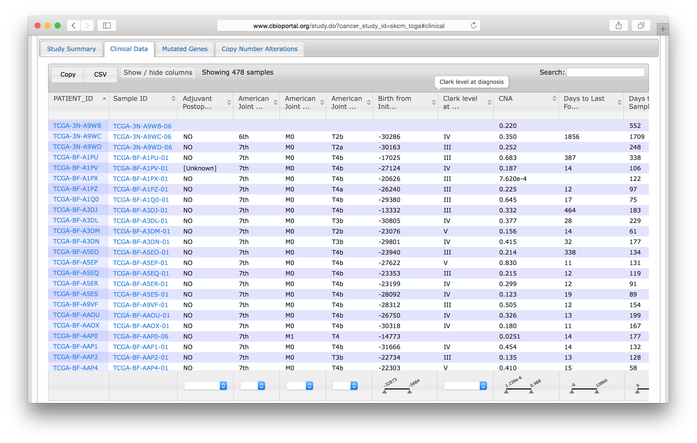
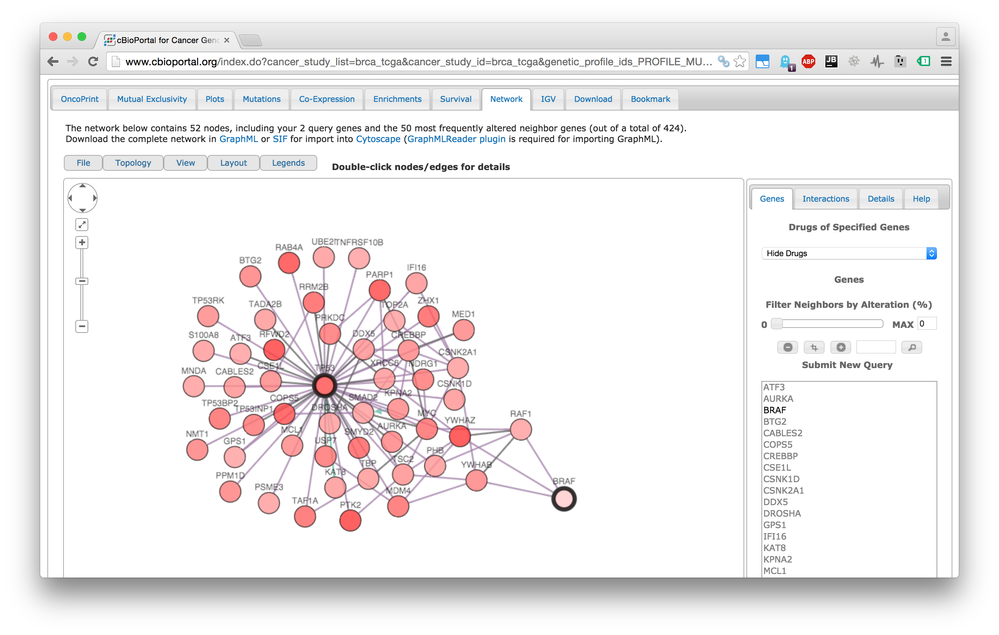

Introduction to CBioPortal
===
author: Augustin Luna
date: 20 January, 2016
width: 960
height: 700
transition: linear
css: rpres.css

<!-- NOTE: Styling and external images may be missing --> 

Research Fellow
   
  Department of Biostatistics and Computational Biology
   
  Dana-Farber Cancer Institute

Topics to be Covered
===
* CBioPortal overview
* Data retrieval from CBioPortal using `cgdsr`
 * List cancer datasets 
 * List data types for dataset
 * List case sets 
 * Retrieve data for selected genes
 * Retrieve clinical data
* Plotting retrieved data

What is CBioPortal?
===
class: smaller-75

* Publication: 
 * http://www.ncbi.nlm.nih.gov/pubmed/23550210
* Provides molecular profiles and clinical attributes from large-scale cancer genomics projects
* Dataset List
 * http://www.cbioportal.org/data_sets.jsp
* Datasets 
 * Total 105 datasets (as of Jan. 2015)
 * TCGA: The Cancer Genome Atlas
 * Cancer Cell Line Encyclopedia
 * NCI-60 (no drug response data)
 * Other collected large-scale datasets from publications

Accessing CBioPortal
===
* Interactive Website: http://www.cbioportal.org/
* Project provides an application programming interface (API) 
 * Makes CBioPortal accessible from any programming language
 * http://www.cbioportal.org/web_api.jsp
* `cgdsr` R Package simplifies access to the CBioPortal API 

CBioPortal Data Types
===
* NOTE: Not all samples will have complete data
  * DNA copy number variation
  * mRNA expression
  * microRNA expression
  * Mutation profiles
  * Protein and phosopho-protein expression
  * DNA methylation
  * Limited de-identified clinical data
 
CBioPortal Data Notes
===
* Notes on the available data
 * http://www.cbioportal.org/faq.jsp
* Example notes
  * Clinical data, includes: overall and disease-free survival, gender, age, stage and tumor grade, when available.
  * mRNA and microRNA data is z-scored (i.e. the number of standard deviations away from the mean of expression

CBioPortal Website Features
===
class: center-img

CBioPortal Tutorials
===
class: center-img

CBioPortal Datasets
===
class: center-img

CBioPortal Home Data Selection
===
class: center-img

CBioPortal OncoPrint
===
class: center-img

CBioPortal Plots
===
class: center-img

CBioPortal Mutations
===
class: center-img

CBioPortal Survival
===
class: center-img

CBioPortal OncoPrinter
===
class: center-img

CBioPortal Mutation Mapper
===
class: center-img

CBioPortal Study: Summary
===
class: center-img

CBioPortal Study: Clinical Data
===
class: center-img

CBioPortal Patient: Summary
===
class: center-img

CBioPortal Patient: Drug Targets
===
class: center-img

CBioPortal Patient: Histology
===
class: center-img

CBioPortal Patient: Pathology
===
class: center-img

CBioPortal Patient: Copy Number
===
class: center-img

CBioPortal Patient: Network
===
class: center-img

What is cgdsr? 
===
class: smaller 

* Website and Tutorial (Vignette):
 * https://cran.r-project.org/web/packages/cgdsr/index.html
* Provides programmatic access to CBioPortal data
   
Getting Help
===
* CBioPortal Google Group
 * http://groups.google.com/group/cbioportal
* Biostars
 * https://www.biostars.org/t/cbioportal/
