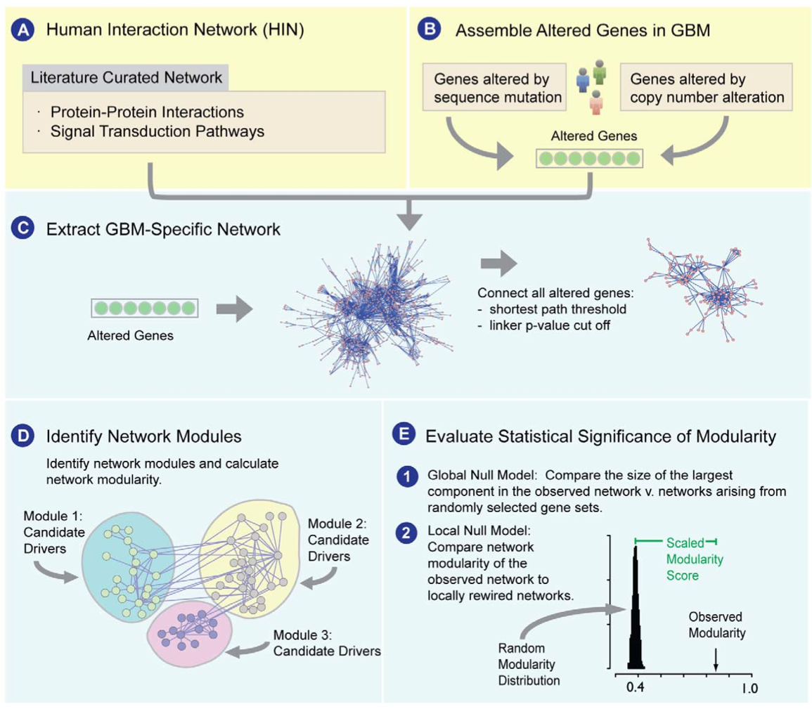
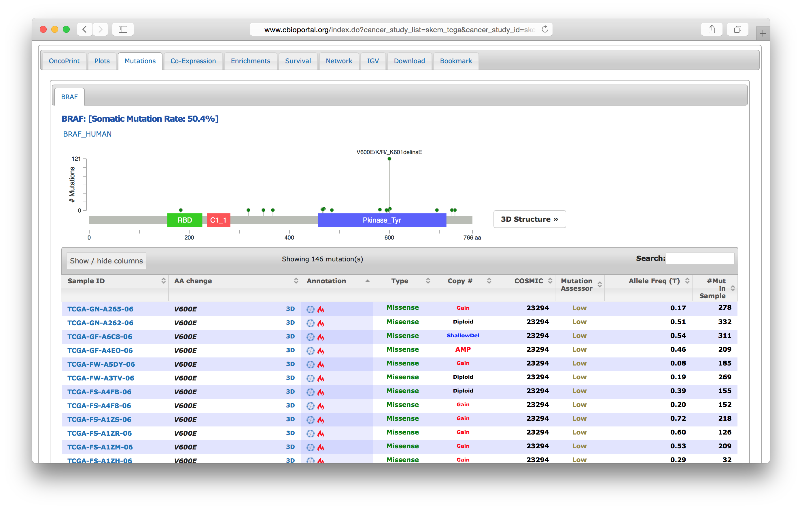

<script>
  (function(i,s,o,g,r,a,m){i['GoogleAnalyticsObject']=r;i[r]=i[r]||function(){
  (i[r].q=i[r].q||[]).push(arguments)},i[r].l=1*new Date();a=s.createElement(o),
  m=s.getElementsByTagName(o)[0];a.async=1;a.src=g;m.parentNode.insertBefore(a,m)
  })(window,document,'script','//www.google-analytics.com/analytics.js','ga');

  ga('create', 'UA-317478-17', 'auto');
  ga('send', 'pageview');

</script>


Data Integration with cgdsr, rcellminer, and paxtoolsr
===
author: Augustin Luna
date: 18 January, 2016
width: 960
height: 700
transition: linear
css: rpres.css

<!-- NOTE: Styling and external images may be missing --> 

<p>Research Fellow
  <br/>
  Department of Biostatistics and Computational Biology
  <br/>
  Dana-Farber Cancer Institute
</p>
<div class="footer" style="display:none;"></div>

Topics to be Covered
===
class: smaller 

* Connecting CellMiner and TCGA data
* Connecting CellMiner data to Pathway Commons

NetBox Algorithm Overview
===
class: center-img



What is netboxr?
===

* `netboxr` is an R implementation of the NetBox algorithm
* Publication: http://journals.plos.org/plosone/article?id=10.1371/journal.pone.0008918

Load Data and Scripts
===


```r
library(rcellminer)
library(rcellminerData)
library(paxtoolsr)
library(netboxr)

# Runs enrichment analysis over many network modules and gene sets
source("files/getClusterOverrepresentation.R")

# Converts a data.frame to a list
source("files/convertDFtoList.R")
```

Install netboxr
===

```r
# Set default repositories
setRepositories(ind=1:6)
options(repos="http://cran.rstudio.com/")

# Install devtools
install.packages("devtools")

library(devtools)

# Install netboxr
install_bitbucket(repo="mil2041/netboxr",
  ref="dec2015", 
  build_vignette=FALSE,
  dependencies=TRUE,
  args="--no-multiarch",	
  auth_user="devbotcc",
  password="devbotcc"
)
```

Get Data
===
class: smaller-75


```r
mutData <- getAllFeatureData(rcellminerData::molData)[["mut"]]

hiMutGenes <- head(sort(rowSums(mutData), decreasing=TRUE), 25)

# Show first 6 entries 
head(hiMutGenes)
```

```
  TP53 COL6A3  SYNE1  USH2A  ACIN1  CSMD2 
    37     28     28     23     22     19 
```

Run NetBox
===
class: smaller-50


```r
geneList <- names(hiMutGenes)
sifNetwork <- downloadPc2("Pathway Commons.7.Reactome.BINARY_SIF.hgnc.sif.gz")

# graphReduced must be an undirected graph
graphReduced <- networkSimplify(sifNetwork, directed=FALSE)
```

```
Loading network of 8718 nodes and 485361 interactions
Treated as undirected network 
Removing multiple interactions and loops
Returning network of 8718 nodes and 357126 interactions
```

```r
results <- geneConnector(geneList=geneList, networkGraph=graphReduced, directed=FALSE, pValueAdj="BH", pValueCutoff=0.05, communityMethod="lec", keepIsolatedNodes=FALSE)
```

```
13 / 25 candidate nodes match the name in the network of 8718 nodes 
Only test neighbor nodes with local degree above 2
Multiple hypothesis corrections for 44 neighbor nodes in the network
For p-value 0.05 cut-off, 41 nodes in the network were included as linker nodes
Remove 2 isolated nodes from input
Connecting 13 candidate nodes and 41 linker nodes
Final network contains 52 nodes and 445 interactions
Detecting module using leading eigenvector method
```

```r
names(results)
```

```
[1] "netboxGraph"      "netboxOutput"     "nodeType"        
[4] "moduleMembership" "neighborData"    
```

Plot netboxr Results
===


rcellminer and cgdsr 
===
class: smaller-75 

* Example: Mutation BRAF V600E is of interest due to prior analysis. Does it appear in the available datasets? 

Identify Probe ID in CellMiner Exome Data
===
class: smaller-75 


```r
library(rcellminer) 

exoProbeIdInfo <- fData(molData[["exo"]])
idx <- which(exoProbeIdInfo$AA_impact == "V600E")
exoProbeIdInfo[idx, ]
```

```
                   Gene          probe.ids           Experiment_Name
chr7:140453136_A_T BRAF chr7:140453136_A_T DNA: Exome SNPs/Mutations
                      dbSNP_id AA_impact AA_accession SNP_1000_genome
chr7:140453136_A_T rs113488022     V600E    NM_004333               0
                   ESP5400 SNP_type SIFT_score Polyphen_score Pfam
chr7:140453136_A_T       0 MISSENSE          0          0.796   NA
                   Variant_class Chromosome  startpos
chr7:140453136_A_T        Type 2          7 140453136
```

Get rcellminer Data
===
class: smaller-75 


```r
probeId <- rownames(exoProbeIdInfo)[idx]

cellminerDat <- exprs(molData[["exo"]])
cellminerDat[probeId, ]
```

```
       BR:MCF7  BR:MDA_MB_231      BR:HS578T      BR:BT_549        BR:T47D 
       0.00000        0.00000        0.00000        0.00000        0.00000 
    CNS:SF_268     CNS:SF_295     CNS:SF_539     CNS:SNB_19     CNS:SNB_75 
       0.00000        0.00000        0.00000        0.00000        0.00000 
      CNS:U251     CO:COLO205    CO:HCC_2998     CO:HCT_116      CO:HCT_15 
       0.00000       70.58824        0.00000        0.00000        0.00000 
       CO:HT29        CO:KM12      CO:SW_620    LE:CCRF_CEM       LE:HL_60 
      21.33333        0.00000        0.00000        0.00000        0.00000 
      LE:K_562      LE:MOLT_4   LE:RPMI_8226          LE:SR     ME:LOXIMVI 
       0.00000        0.00000        0.00000        0.00000       73.68421 
   ME:MALME_3M         ME:M14    ME:SK_MEL_2   ME:SK_MEL_28    ME:SK_MEL_5 
      77.19298       82.35294        0.00000      100.00000       41.93548 
   ME:UACC_257     ME:UACC_62  ME:MDA_MB_435       ME:MDA_N        LC:A549 
      63.15789      100.00000       77.02703       78.02198        0.00000 
       LC:EKVX      LC:HOP_62      LC:HOP_92    LC:NCI_H226     LC:NCI_H23 
       0.00000        0.00000        0.00000        0.00000        0.00000 
  LC:NCI_H322M    LC:NCI_H460    LC:NCI_H522      OV:IGROV1     OV:OVCAR_3 
       0.00000        0.00000        0.00000        0.00000        0.00000 
    OV:OVCAR_4     OV:OVCAR_5     OV:OVCAR_8     OV:SK_OV_3 OV:NCI_ADR_RES 
       0.00000        0.00000        0.00000        0.00000        0.00000 
       PR:PC_3      PR:DU_145       RE:786_0        RE:A498        RE:ACHN 
       0.00000        0.00000        0.00000        0.00000        0.00000 
     RE:CAKI_1     RE:RXF_393       RE:SN12C       RE:TK_10       RE:UO_31 
       0.00000        0.00000        0.00000        0.00000        0.00000 
```

Get BRAF-V600E Melanoma Mutation Count from CBioPortal
===
class: smaller-75 


```r
library(cgdsr)
mycgds <- CGDS("http://www.cbioportal.org/")

# Use the functions below to navigate the CBioPortal data
getCancerStudies(mycgds)
getGeneticProfiles(mycgds,'skcm_tcga')[,c(1:2)]
getCaseLists(mycgds,'skcm_tcga')[,c(1:2)]
```


```r
portalDat <- getProfileData(mycgds, "BRAF", c("skcm_tcga_mutations"), "skcm_tcga_3way_complete")
length(which(portalDat[, "BRAF"] == "V600E"))
```

```
[1] 102
```

CBioPortal Screenshot
===
class: center-img 


