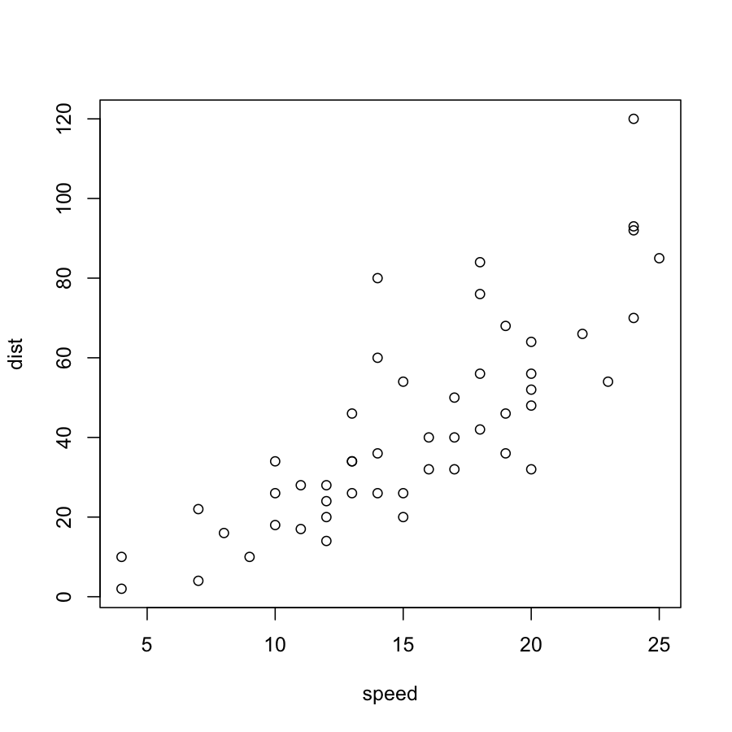

Introduction to Clustering
========================================================
author: Augustin Luna (lunaa@jimmy.harvard.edu)
date: University of Sao Paulo, 06 January, 2016
autosize: true
width: 960
height: 700
css: example.css

<div class="footer"></div>

Outline
========================================================
* Hierarchical Clustering 
 * What
* What
* Is 
* This

Scree Test
========================================================
eu

Scree Test
========================================================


```r
summary(cars)
```

```
     speed           dist       
 Min.   : 4.0   Min.   :  2.00  
 1st Qu.:12.0   1st Qu.: 26.00  
 Median :15.0   Median : 36.00  
 Mean   :15.4   Mean   : 42.98  
 3rd Qu.:19.0   3rd Qu.: 56.00  
 Max.   :25.0   Max.   :120.00  
```

Slide With Plot
========================================================


Code Only Slide
====================================

```r
summary(cars)
predict(model, newdata=data.frame(Units=4))
predict(model, newdata=data.frame(Units=4), interval = "pred")
predict(model, newdata=data.frame(Units=4), interval = "confidence")
```

Output Only Slide
====================================
| Right | Left | Default | Center |
|------:|:-----|---------|:------:|
| 12 | 12 | 12 | 12 |
| 123 | 123 | 123 | 123 |
| 1 | 1 | 1 | 1 |


```
     speed           dist       
 Min.   : 4.0   Min.   :  2.00  
 1st Qu.:12.0   1st Qu.: 26.00  
 Median :15.0   Median : 36.00  
 Mean   :15.4   Mean   : 42.98  
 3rd Qu.:19.0   3rd Qu.: 56.00  
 Max.   :25.0   Max.   :120.00  
```

Slide With Image Left
====================================

***
The equation is $\frac{1}{n} \sum_{i=i}^{n} x_{i}$


Two-Column Slide
====================================
left: 70%

First Column 

For more details on autoring R presentations please visit authoring R presentations please visit


***
Second column

For more details on authoring R presentations please visit authoring R presentations please visit
