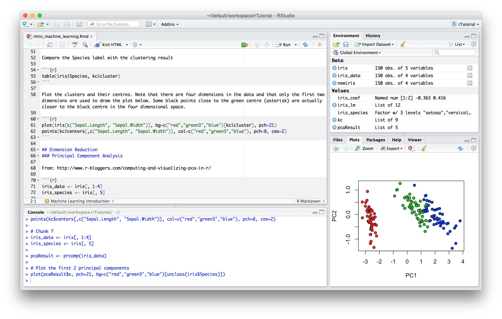
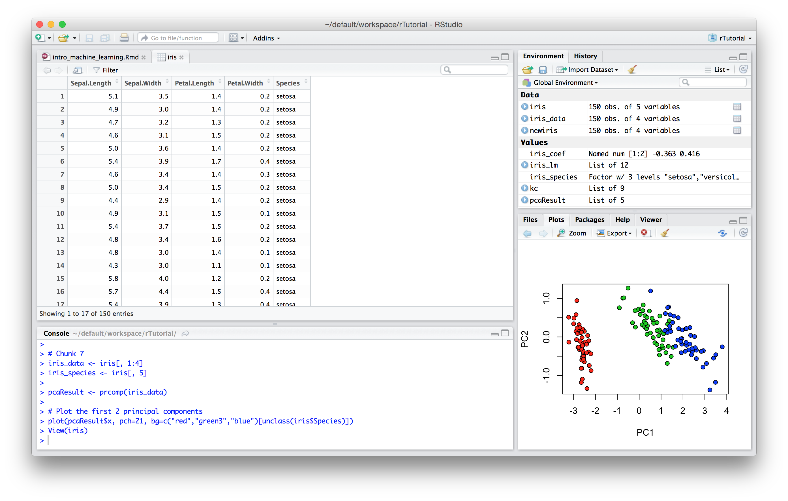
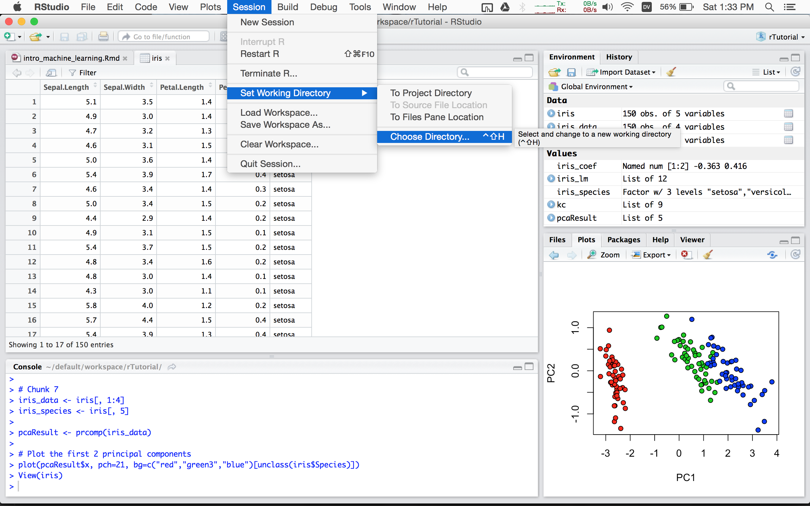
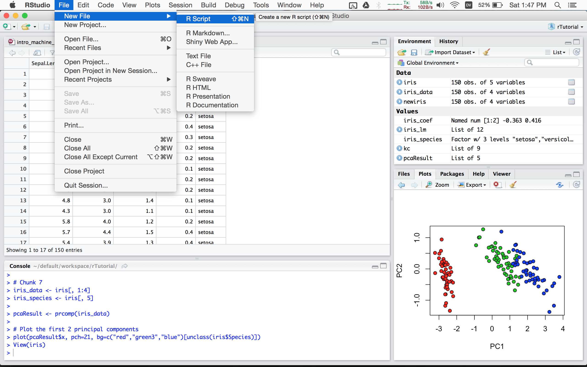
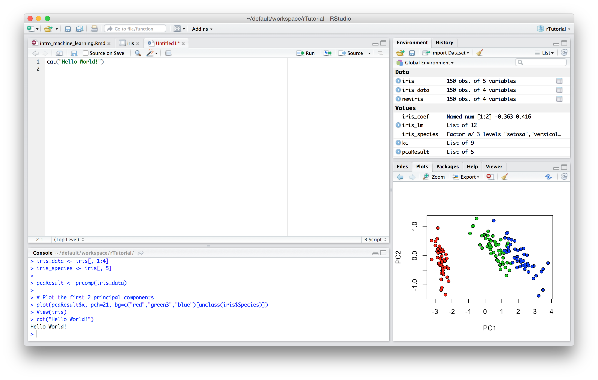
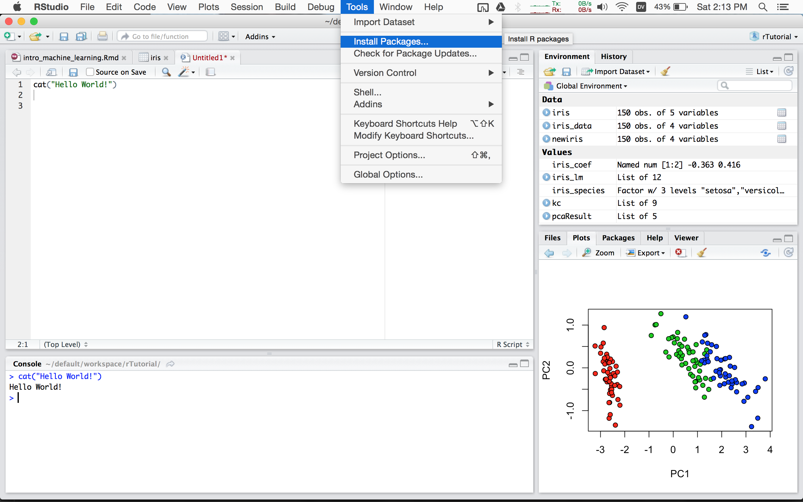

Overview
===
author: Augustin Luna
date: 09 January, 2016
width: 960
height: 700
transition: linear
css: rpres.css

<div class="guide horz" style="height: 0%; width: 100%; top: 10%; left: 0%"></div>
<div class="guide horz" style="height: 0%; width: 100%; top: 20%; left: 0%"></div>
<div class="guide horz" style="height: 0%; width: 100%; top: 30%; left: 0%"></div>
<div class="guide horz" style="height: 0%; width: 100%; top: 40%; left: 0%"></div>
<div class="middle-guide horz" style="height: 0%; width: 100%; top: 50%; left: 0%"></div>
<div class="guide horz" style="height: 0%; width: 100%; top: 60%; left: 0%"></div>
<div class="guide horz" style="height: 0%; width: 100%; top: 70%; left: 0%"></div>
<div class="guide horz" style="height: 0%; width: 100%; top: 80%; left: 0%"></div>
<div class="guide horz" style="height: 0%; width: 100%; top: 90%; left: 0%"></div>

<div class="guide vert" style="height: 100%; width: 0%; top: 0%; left: 10%"></div>
<div class="guide vert" style="height: 100%; width: 0%; top: 0%; left: 20%"></div>
<div class="guide vert" style="height: 100%; width: 0%; top: 0%; left: 30%"></div>
<div class="guide vert" style="height: 100%; width: 0%; top: 0%; left: 40%"></div>
<div class="middle-guide vert" style="height: 100%; width: 0%; top: 0%; left: 50%"></div>
<div class="guide vert" style="height: 100%; width: 0%; top: 0%; left: 60%"></div>
<div class="guide vert" style="height: 100%; width: 0%; top: 0%; left: 70%"></div>
<div class="guide vert" style="height: 100%; width: 0%; top: 0%; left: 80%"></div>
<div class="guide vert" style="height: 100%; width: 0%; top: 0%; left: 90%"></div>

<!-- NOTE: Styling and external images may be missing --> 

<p>Research Fellow
  <br/>
  Department of Biostatistics and Computational Biology
  <br/>
  Dana-Farber Cancer Institute
</p>
<div class="footer" style="display:none;"></div>

Topics to be Covered
===
* R: Language Basics, Plotting, Getting Help
* Using the RStudio Editor
* Machine Learning Fundamentals
 * Dimension Reduction
 * Regression
 * Clustering
* Accessing Datasets: CellMiner (cell lines/drugs), CBioPortal (patient samples), Pathway Commons (pathways)
* Developing Web Applications 

What is R?
===
* Free, open source
* Started in 1993
* Geared towards scientific computing
 * Created by Ross Ihaka and Robert Gentleman (statisticians)
* Interpreted; similar to Python and MATLAB

Why is R Popular? 
===
* Free, open source 
* Interactive data analysis 
 * Script-driven rather than menu-driven helps reproducibility
* Flexible and powerful plotting support
* Excellent package management system 
 * Large and growing collection of statistical analysis methods
 * Simple package installation; dependency management
 * R scripts usually portable to other platforms 
 * Package repositories ensure functionality, documentation, and interoperability
 * Vignettes (tutorials) provided as runnable analyses 

Extending R and Package Repositories
===
* Comprehensive R Archive Network (CRAN) 
 * 5,800 R packages (as of June 2014)
 * Many packages call C, C++, Fortran, or Java code for speedups
* Bioconductor 
 * 800+ R packages focused on bioinformatics
 * 50+ packages dedicated to pathway analysis
* Devtools 
 * R package that allows package installation from code repositories
 
RStudio
===

* https://www.rstudio.com/
* Available for Windows, OSX, and Linux
* Simplifies common tasks: plotting, package installation, accessing files, 
viewing variables, etc.

Installing R and RStudio
===

* Install R
 * https://cran.rstudio.com/
* Install RStudio
 * https://www.rstudio.com/products/rstudio/download/
* RStudio does not come with R and R must be installed first

RStudio Overview
===
class: center-img

<div class="guide horz" style="height: 0%; width: 100%; top: 10%; left: 0%"></div>
<div class="guide horz" style="height: 0%; width: 100%; top: 20%; left: 0%"></div>
<div class="guide horz" style="height: 0%; width: 100%; top: 30%; left: 0%"></div>
<div class="guide horz" style="height: 0%; width: 100%; top: 40%; left: 0%"></div>
<div class="middle-guide horz" style="height: 0%; width: 100%; top: 50%; left: 0%"></div>
<div class="guide horz" style="height: 0%; width: 100%; top: 60%; left: 0%"></div>
<div class="guide horz" style="height: 0%; width: 100%; top: 70%; left: 0%"></div>
<div class="guide horz" style="height: 0%; width: 100%; top: 80%; left: 0%"></div>
<div class="guide horz" style="height: 0%; width: 100%; top: 90%; left: 0%"></div>

<div class="guide vert" style="height: 100%; width: 0%; top: 0%; left: 10%"></div>
<div class="guide vert" style="height: 100%; width: 0%; top: 0%; left: 20%"></div>
<div class="guide vert" style="height: 100%; width: 0%; top: 0%; left: 30%"></div>
<div class="guide vert" style="height: 100%; width: 0%; top: 0%; left: 40%"></div>
<div class="middle-guide vert" style="height: 100%; width: 0%; top: 0%; left: 50%"></div>
<div class="guide vert" style="height: 100%; width: 0%; top: 0%; left: 60%"></div>
<div class="guide vert" style="height: 100%; width: 0%; top: 0%; left: 70%"></div>
<div class="guide vert" style="height: 100%; width: 0%; top: 0%; left: 80%"></div>
<div class="guide vert" style="height: 100%; width: 0%; top: 0%; left: 90%"></div>

 


<div class="box" style="height: 10%; width: 20%; top: 30%; left: 20%">
  <span class="filled" style="font-size: 2rem !important">Editor<span>
</div>

<div class="box" style="height: 10%; width: 20%; top: 30%; left: 70%">
  <span class="filled" style="font-size: 2rem !important">Environment<span>
</div>

<div class="box" style="height: 10%; width: 10%; top: 70%; left: 75%">
  <span class="filled" style="font-size: 2rem !important">Plot<span>
</div>

<div class="box" style="height: 10%; width: 20%; top: 70%; left: 20%">
  <span class="filled" style="font-size: 2rem !important">Console<span>
</div>

Table View of Variables
===
class: center-img

<div class="guide horz" style="height: 0%; width: 100%; top: 10%; left: 0%"></div>
<div class="guide horz" style="height: 0%; width: 100%; top: 20%; left: 0%"></div>
<div class="guide horz" style="height: 0%; width: 100%; top: 30%; left: 0%"></div>
<div class="guide horz" style="height: 0%; width: 100%; top: 40%; left: 0%"></div>
<div class="middle-guide horz" style="height: 0%; width: 100%; top: 50%; left: 0%"></div>
<div class="guide horz" style="height: 0%; width: 100%; top: 60%; left: 0%"></div>
<div class="guide horz" style="height: 0%; width: 100%; top: 70%; left: 0%"></div>
<div class="guide horz" style="height: 0%; width: 100%; top: 80%; left: 0%"></div>
<div class="guide horz" style="height: 0%; width: 100%; top: 90%; left: 0%"></div>

<div class="guide vert" style="height: 100%; width: 0%; top: 0%; left: 10%"></div>
<div class="guide vert" style="height: 100%; width: 0%; top: 0%; left: 20%"></div>
<div class="guide vert" style="height: 100%; width: 0%; top: 0%; left: 30%"></div>
<div class="guide vert" style="height: 100%; width: 0%; top: 0%; left: 40%"></div>
<div class="middle-guide vert" style="height: 100%; width: 0%; top: 0%; left: 50%"></div>
<div class="guide vert" style="height: 100%; width: 0%; top: 0%; left: 60%"></div>
<div class="guide vert" style="height: 100%; width: 0%; top: 0%; left: 70%"></div>
<div class="guide vert" style="height: 100%; width: 0%; top: 0%; left: 80%"></div>
<div class="guide vert" style="height: 100%; width: 0%; top: 0%; left: 90%"></div>


* Highlighted boxes open a table view of variable contents



<div class="box" style="height: 7%; width: 2.25%; top: 36%; left: 84.5%"></div>

Change Current Directory
===
class: center-img

<div class="guide horz" style="height: 0%; width: 100%; top: 10%; left: 0%"></div>
<div class="guide horz" style="height: 0%; width: 100%; top: 20%; left: 0%"></div>
<div class="guide horz" style="height: 0%; width: 100%; top: 30%; left: 0%"></div>
<div class="guide horz" style="height: 0%; width: 100%; top: 40%; left: 0%"></div>
<div class="middle-guide horz" style="height: 0%; width: 100%; top: 50%; left: 0%"></div>
<div class="guide horz" style="height: 0%; width: 100%; top: 60%; left: 0%"></div>
<div class="guide horz" style="height: 0%; width: 100%; top: 70%; left: 0%"></div>
<div class="guide horz" style="height: 0%; width: 100%; top: 80%; left: 0%"></div>
<div class="guide horz" style="height: 0%; width: 100%; top: 90%; left: 0%"></div>

<div class="guide vert" style="height: 100%; width: 0%; top: 0%; left: 10%"></div>
<div class="guide vert" style="height: 100%; width: 0%; top: 0%; left: 20%"></div>
<div class="guide vert" style="height: 100%; width: 0%; top: 0%; left: 30%"></div>
<div class="guide vert" style="height: 100%; width: 0%; top: 0%; left: 40%"></div>
<div class="middle-guide vert" style="height: 100%; width: 0%; top: 0%; left: 50%"></div>
<div class="guide vert" style="height: 100%; width: 0%; top: 0%; left: 60%"></div>
<div class="guide vert" style="height: 100%; width: 0%; top: 0%; left: 70%"></div>
<div class="guide vert" style="height: 100%; width: 0%; top: 0%; left: 80%"></div>
<div class="guide vert" style="height: 100%; width: 0%; top: 0%; left: 90%"></div>


* Highlighted boxes open a table view of variable contents



Making a New R Script
===
class: center-img

<div class="guide horz" style="height: 0%; width: 100%; top: 10%; left: 0%"></div>
<div class="guide horz" style="height: 0%; width: 100%; top: 20%; left: 0%"></div>
<div class="guide horz" style="height: 0%; width: 100%; top: 30%; left: 0%"></div>
<div class="guide horz" style="height: 0%; width: 100%; top: 40%; left: 0%"></div>
<div class="middle-guide horz" style="height: 0%; width: 100%; top: 50%; left: 0%"></div>
<div class="guide horz" style="height: 0%; width: 100%; top: 60%; left: 0%"></div>
<div class="guide horz" style="height: 0%; width: 100%; top: 70%; left: 0%"></div>
<div class="guide horz" style="height: 0%; width: 100%; top: 80%; left: 0%"></div>
<div class="guide horz" style="height: 0%; width: 100%; top: 90%; left: 0%"></div>

<div class="guide vert" style="height: 100%; width: 0%; top: 0%; left: 10%"></div>
<div class="guide vert" style="height: 100%; width: 0%; top: 0%; left: 20%"></div>
<div class="guide vert" style="height: 100%; width: 0%; top: 0%; left: 30%"></div>
<div class="guide vert" style="height: 100%; width: 0%; top: 0%; left: 40%"></div>
<div class="middle-guide vert" style="height: 100%; width: 0%; top: 0%; left: 50%"></div>
<div class="guide vert" style="height: 100%; width: 0%; top: 0%; left: 60%"></div>
<div class="guide vert" style="height: 100%; width: 0%; top: 0%; left: 70%"></div>
<div class="guide vert" style="height: 100%; width: 0%; top: 0%; left: 80%"></div>
<div class="guide vert" style="height: 100%; width: 0%; top: 0%; left: 90%"></div>




First Script: Hello World!
===

* `cat()` prints a simple message in the console


```r
cat("Hello World!")
```

```
Hello World!
```

Running Hello World Script
===
class: center-img

<div class="guide horz" style="height: 0%; width: 100%; top: 10%; left: 0%"></div>
<div class="guide horz" style="height: 0%; width: 100%; top: 20%; left: 0%"></div>
<div class="guide horz" style="height: 0%; width: 100%; top: 30%; left: 0%"></div>
<div class="guide horz" style="height: 0%; width: 100%; top: 40%; left: 0%"></div>
<div class="middle-guide horz" style="height: 0%; width: 100%; top: 50%; left: 0%"></div>
<div class="guide horz" style="height: 0%; width: 100%; top: 60%; left: 0%"></div>
<div class="guide horz" style="height: 0%; width: 100%; top: 70%; left: 0%"></div>
<div class="guide horz" style="height: 0%; width: 100%; top: 80%; left: 0%"></div>
<div class="guide horz" style="height: 0%; width: 100%; top: 90%; left: 0%"></div>

<div class="guide vert" style="height: 100%; width: 0%; top: 0%; left: 10%"></div>
<div class="guide vert" style="height: 100%; width: 0%; top: 0%; left: 20%"></div>
<div class="guide vert" style="height: 100%; width: 0%; top: 0%; left: 30%"></div>
<div class="guide vert" style="height: 100%; width: 0%; top: 0%; left: 40%"></div>
<div class="middle-guide vert" style="height: 100%; width: 0%; top: 0%; left: 50%"></div>
<div class="guide vert" style="height: 100%; width: 0%; top: 0%; left: 60%"></div>
<div class="guide vert" style="height: 100%; width: 0%; top: 0%; left: 70%"></div>
<div class="guide vert" style="height: 100%; width: 0%; top: 0%; left: 80%"></div>
<div class="guide vert" style="height: 100%; width: 0%; top: 0%; left: 90%"></div>


* "Run" button runs current line or selected lines
* "Source" button runs all lines in file



<div class="box" style="height: 3%; width: 10%; top: 39.2%; left: 49.5%"></div>

Installing Packages
===
class: center-img

<div class="guide horz" style="height: 0%; width: 100%; top: 10%; left: 0%"></div>
<div class="guide horz" style="height: 0%; width: 100%; top: 20%; left: 0%"></div>
<div class="guide horz" style="height: 0%; width: 100%; top: 30%; left: 0%"></div>
<div class="guide horz" style="height: 0%; width: 100%; top: 40%; left: 0%"></div>
<div class="middle-guide horz" style="height: 0%; width: 100%; top: 50%; left: 0%"></div>
<div class="guide horz" style="height: 0%; width: 100%; top: 60%; left: 0%"></div>
<div class="guide horz" style="height: 0%; width: 100%; top: 70%; left: 0%"></div>
<div class="guide horz" style="height: 0%; width: 100%; top: 80%; left: 0%"></div>
<div class="guide horz" style="height: 0%; width: 100%; top: 90%; left: 0%"></div>

<div class="guide vert" style="height: 100%; width: 0%; top: 0%; left: 10%"></div>
<div class="guide vert" style="height: 100%; width: 0%; top: 0%; left: 20%"></div>
<div class="guide vert" style="height: 100%; width: 0%; top: 0%; left: 30%"></div>
<div class="guide vert" style="height: 100%; width: 0%; top: 0%; left: 40%"></div>
<div class="middle-guide vert" style="height: 100%; width: 0%; top: 0%; left: 50%"></div>
<div class="guide vert" style="height: 100%; width: 0%; top: 0%; left: 60%"></div>
<div class="guide vert" style="height: 100%; width: 0%; top: 0%; left: 70%"></div>
<div class="guide vert" style="height: 100%; width: 0%; top: 0%; left: 80%"></div>
<div class="guide vert" style="height: 100%; width: 0%; top: 0%; left: 90%"></div>


* CRAN packages can be installed using RStudio or `install.packages()`


