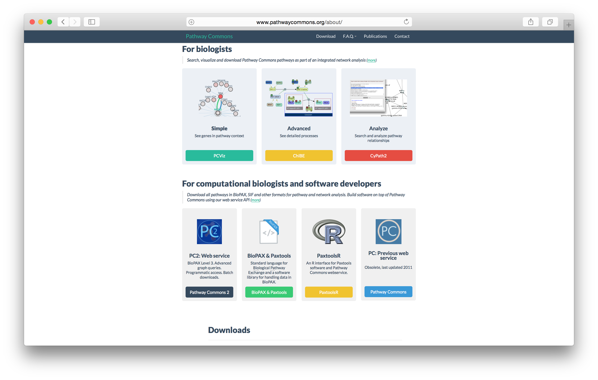
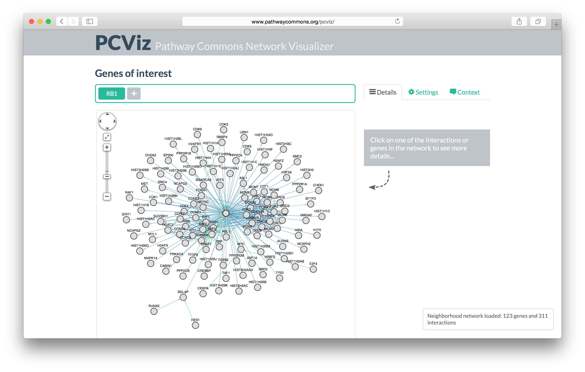
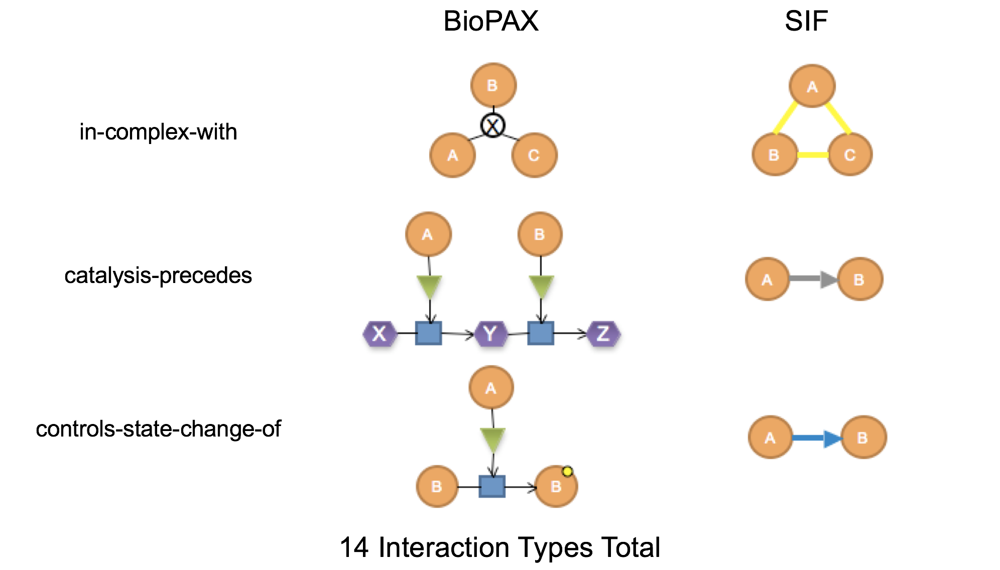

<script>
  (function(i,s,o,g,r,a,m){i['GoogleAnalyticsObject']=r;i[r]=i[r]||function(){
  (i[r].q=i[r].q||[]).push(arguments)},i[r].l=1*new Date();a=s.createElement(o),
  m=s.getElementsByTagName(o)[0];a.async=1;a.src=g;m.parentNode.insertBefore(a,m)
  })(window,document,'script','//www.google-analytics.com/analytics.js','ga');

  ga('create', 'UA-317478-17', 'auto');
  ga('send', 'pageview');

</script>


Introduction to Pathway Commons
===
author: Augustin Luna
date: 21 January, 2016
width: 960
height: 700
transition: linear
css: rpres.css

<!-- NOTE: Styling and external images may be missing --> 

<p>Research Fellow
  <br/>
  Department of Biostatistics and Computational Biology
  <br/>
  Dana-Farber Cancer Institute
</p>
<div class="footer" style="display:none;"></div>

Topics to be Covered
===
* Overview of BioPAX and Pathway Commons
* Accessing Pathway Commons (PC) using `paxtoolsr`
 * Searching PC
 * Visualizing PC Data
 * Overlaying Experimental Data on PC Networks
 * Getting Network Statistics 
 * Gene Set Enrichment with PC
 * ID Mapping 

What is Pathway Commons? 
===
* Website: http://www.pathwaycommons.org/
* An aggregation of public pathway database information
* Provides data in multiple formats
 * Biological Pathway Exchange (BioPAX) Format
 * Simple Interaction Format (SIF)
 * Gene sets as Gene Matrix Transposed (GMT) Format
* Provides infrastructure for searching the aggregated pathway data

Biological Pathway Exchange (BioPAX) Format
===
class: smaller-75

* BioPAX: http://biopax.org/
* Community-wide effort to represent biological pathways
 * Pathways are collections of interactions that biologists have found useful to group together for organizational, historic, biophysical or other reasons
* Types
 * Metabolic pathways
 * Signaling pathways
 * Protein-protein interactions
 * Gene regulatory pathways
* Advanced tutorial on BioPAX
 * https://github.com/cannin/biopaxTutorial
 
Pathway Commons Homepage
===
class: center-img



Pathway Commons Visualizer
===
class: center-img

 
 
Pathway Commons Datasets
===
class: smaller

|Database|Interaction Count|
|---|---|
|Reactome|11924|
|NCI PID|16017|
|PhosphoSitePlus|13642|
|HumanCyc|7024|
|HPRD|40618|
|PantherDB|5282|
|DIP|7102|
|BioGRID|244843|

***

|Database|Interaction Count|
|---|---|
|InAct|98347|
|BIND|35566|
|TRANSFAC|261624|
|mirTarBase|51214|
|DrugBank|19159|
|Recon X|10910|
|CTD|313174|
|KEGG|4472|

Simple Interaction Format (SIF) 
===
* An edgelist with interaction type: 3 columns
 * PARTICIPANT_A, INTERACTION_TYPE, PARTICPANT_B
* Expected representation for many network analyses 
* Extracted using graph queries that detect biologically interesting interaction patterns in Pathway Commons data 
 * Complexes, metabolic, modification, control interactions
 * Generates binary interactions and integrates them across databases

SIF Interaction Types
===
class: center-img

* [Complete list of interaction types in Google Docs](https://docs.google.com/document/d/1coFo66uuPQQ4ZMSHr8IzCV7I2DwXCoDBfZw7Vg4MgUE/edit?usp=sharing)
* Examples of conversions from BioPAX to SIF



Gene Set (GMT) Format
===
class: smaller-75

|Gene Set|Description|Gene 1|Gene 2|Gene 3| ... |
|---|---|---|---|---|---|
|KEGG_GLYCOLYSIS_GLUCONEOGENESIS|KEGG|GCK|PGK2|PGK1|...|
|REACTOME_SIGNALING_BY_EGFR_IN_CANCER|Reactome|AKT3|ADAM10|SPRY1|...|

What is paxtoolsr?
===
class: smaller-75

* Website and Tutorial (Vignette):    
 * https://bioconductor.org/packages/release/bioc/html/paxtoolsr.html
* Publication: 
 * http://www.ncbi.nlm.nih.gov/pubmed/26685306
* Read and write
 * Biological Pathway Exchange (BioPAX)
 * Binary Simple Interaction Format (SIF) 
 * Extended SIF: Includes additional information about SIF network
 * Gene Set (GMT)
 * Systems Biology Graphical Notation Markup Language (SBGN-ML) 
* Search and summarize local BioPAX files
* Search Pathway Commons 

Enrichment Analysis with Pathway Commons and CellMiner
===
class: smaller-50

* Example on conducting an enrichment analysis on CellMiner cell line data using gene sets from Pathway Commons


```r
# Load libraries
library(paxtoolsr); library(rcellminer)

# Load data
geneSets <- downloadPc2("Pathway Commons.7.Reactome.GSEA.hgnc.gmt.gz")
mutData <- getAllFeatureData(rcellminerData::molData)[["mut"]]

hiMutGenes <- head(sort(rowSums(mutData), decreasing=TRUE), 25)

# Initialize variable
pvals <- NULL

for(set in geneSets) {
  #set <- hiMutGenes
  sampleSize <- length(hiMutGenes) # size drawn
  hitInSample <- length(which(hiMutGenes %in% set)) # black drawn
  hitInPop <- length(which(rownames(mutData) %in% set)) # all black 
  failInPop <- nrow(mutData)-hitInPop # number of red
  # Calculate over-enrichment for current gene set
  pval <- phyper(hitInSample-1, hitInPop, failInPop, sampleSize, lower.tail= FALSE)
  # Add current result
  pvals <- c(pvals, pval)
}

# Adjust p-values
pvals <- p.adjust(pvals, method="fdr")
length(pvals[pvals < 0.05])
```

```
[1] 0
```

Getting Help
===
* BioPAX Google Group
 * http://groups.google.com/group/biopax
* Biostars
 * https://www.biostars.org
* Online Contact Form
 * http://www.pathwaycommons.org/pc/get_feedback.do
