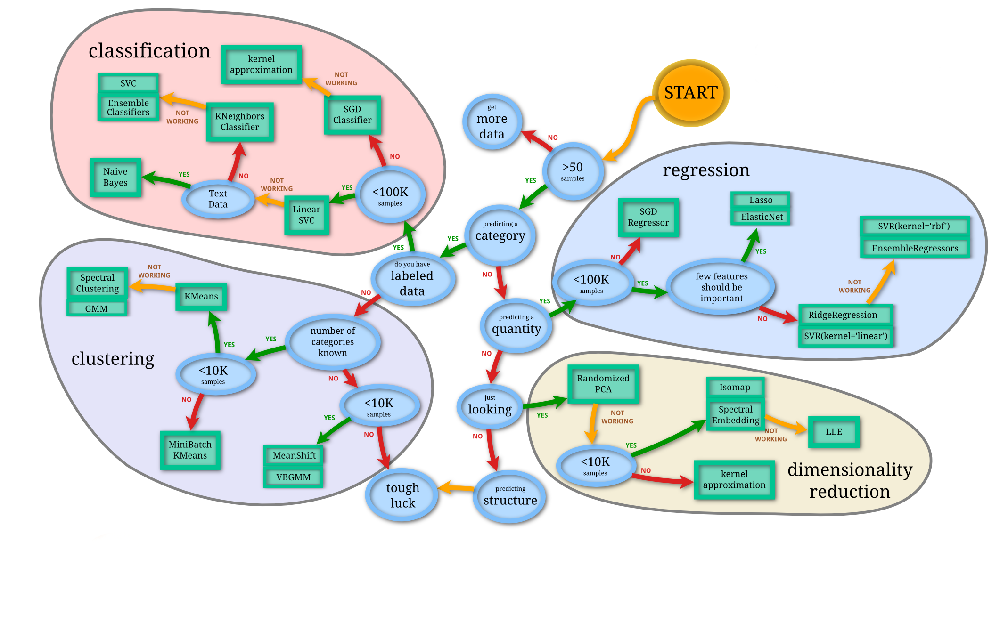
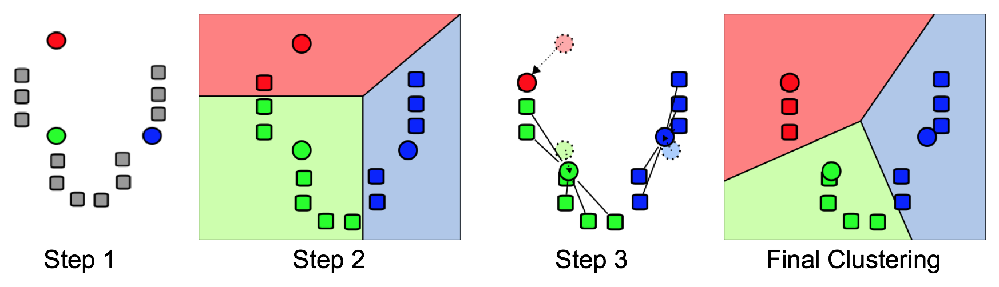

<script>
  (function(i,s,o,g,r,a,m){i['GoogleAnalyticsObject']=r;i[r]=i[r]||function(){
  (i[r].q=i[r].q||[]).push(arguments)},i[r].l=1*new Date();a=s.createElement(o),
  m=s.getElementsByTagName(o)[0];a.async=1;a.src=g;m.parentNode.insertBefore(a,m)
  })(window,document,'script','//www.google-analytics.com/analytics.js','ga');

  ga('create', 'UA-317478-17', 'auto');
  ga('send', 'pageview');

</script>

<script src='https://ajax.googleapis.com/ajax/libs/jquery/2.2.0/jquery.min.js'></script>
<script>
$(window).bind('load', function() {
  Reveal.addEventListener('slidechanged', function(event) {
    console.log('Slide Index: ' + event.indexh);
    ga('send', 'event', 'Slide Index', 'click', event.indexh);
  });
});
</script>


Introduction to Statistical Methods
===
author: Augustin Luna
date: 26 January, 2016
width: 960
height: 700
transition: linear
css: rpres.css

<!-- NOTE: Styling and external images may be missing --> 
<p>Research Fellow
  <br/>
  Department of Biostatistics and Computational Biology
  <br/>
  Dana-Farber Cancer Institute
</p>
<div class="footer" style="display:none;"></div>

Topics to be Covered
===
* Correlations
* Enrichment Analyses
* Multiple Testing Correction
* Regression
* Clustering
* Dimensionality Reduction

Introduction
===
* Data analyses are the product of many tasks
* Statistical Methods
 * Build predictive mathematical models 
* Data preparation
 * Extracting structured data from unstructured data sources 
 * Merging data sources 
 * Ensuring consistency of datasets 
* Dataset interpretation 
 * Create visualizations to present and communicate findings
* Methods are common in the areas of informatics, data mining, data science, machine learning, and statistics 

Statistical Methods Flowchart
===
class: center-img, smaller

* The flowchart below helps find the right method for a given problem 
 * http://scikit-learn.org/stable/tutorial/machine_learning_map/
 


Methods to be Covered
===
* Basic method will be covered to build confidence with R and the general concepts
 * Dimensionality Reduction: Principal Component Analysis (PCA)
 * Regression: Linear regression
 * Clustering: Hierarchical and K-means clustering
 * Classification will not be covered

Correlating Two Vectors
===
class: smaller-75


```r
# Make sure the random numbers are always the same 
set.seed(1)

# Generate two sets of 20 random numbers
a <- runif(20); b <- runif(20)

# Calulate the correlation of the two sets
cor.test(a, b)
```

```

	Pearson's product-moment correlation

data:  a and b
t = -1.0368, df = 18, p-value = 0.3136
alternative hypothesis: true correlation is not equal to 0
95 percent confidence interval:
 -0.6152730  0.2292138
sample estimates:
       cor 
-0.2373854 
```

Extracting Values From Results
===
class: smaller-75

* Values in results are described in the help `?cor.test`
* A p-value is the probability of seeing results as extreme as the ones produced in an analysis.


```r
set.seed(1)

a <- runif(20)
b <- runif(20)

results <- cor.test(a, b, method="pearson")
names(results)
```

```
[1] "statistic"   "parameter"   "p.value"     "estimate"    "null.value" 
[6] "alternative" "method"      "data.name"   "conf.int"   
```

```r
results$p.value
```

```
[1] 0.3135682
```

Over-Representation (ORA) and Enrichment Analyses
===
class: smaller

* Enrichment tests are widely used in biology to determine if the genes contain a trait more frequently than a random sampling of genes
 * Gene Ontology (GO) term (e.g. biological process, molecular function, or cellular component) and pathways are the most common comparisons made
* Several tools exist for doing enrichment analyses
 * The tests are either Fisher's exact test or hypergeometric test; these tests produce the same results
 * These calculations can be done in R using `fisher.test` and `phyper`

Enrichment Analysis 
===
class: smaller 

* What is the probability of randomly drawing at least 4 black points in a random sample of 10 points? 
 * The concept of "black" could be replaced by "genes from a given pathway" or "genes with a common function"


 
Calculating an ORA (Enrichment) P-Value
===
class: smaller-60

The significance (i.e. p-value $P(X \geq k)$) of an over-representation (enrichment analysis) is calculated using a hypergeometric test:

$$
\begin{align}
P(X \geq k) = 1 - \sum_{i=0}^{k-1}{\frac{\binom{K}{i}\binom{N-K}{n-i}}{\binom{N}{n}}}
\end{align}
$$

where 

* N: number of studied genes, 
* n: total number of genes identified by a previous analysis
* K: total number of genes in with an annotation
* k: number genes previously identified genes with the annotation
* $\binom{n}{k}$: the number of of ways of choosing $k$ elements from a set of $n$ elements, disregarding order

The p-value of this test indicates the probability that a random selection of genes of the same size as the input gene set from a population would produce the same number of observed annotations (e.g. for a specific GO term or pathway) or more in the gene set 
 
Choose k from N Without Order
===
class: smaller-75
left: 75%


```r
N <- 5
k <- 3
factorial(N) / (factorial(k)*factorial(N-k))
```

```
[1] 10
```

***


```r
N <- 5
k <- 3
choose(N, k)
```

```
[1] 10
```
 
Contingency Table for Enrichment Analysis
===

|       | Drawn | Not Drawn  | Total   | 
|-------|-------|------------|---------|
| Black | k=4   | K-k=1      | K=5     |
| Red   | n-k=6 | N+k-n-K=39 | N-K=45  |
| Total | n=10  | N-n=40     | N=50    |

phyper or fisher.test Example
===
class: smaller-75

* NOTE: `hitInSample-1` is nescessary in `phyper` beacuse if `lower.tail` is FALSE, probabilities returned are P(X > k). Subtract k by 1 to get P(X ≥ k) (k equal to or greater than).


```r
sampleSize <- 10 # size drawn
hitInSample <- 4 # black drawn
hitInPop <- 5 # all black 
failInPop <- 50-hitInPop # number of red

phyper(hitInSample-1, hitInPop, failInPop, sampleSize, lower.tail= FALSE);
```

```
[1] 0.004083521
```

```r
fisher.test(matrix(c(hitInSample, hitInPop-hitInSample, sampleSize-hitInSample, failInPop-sampleSize+hitInSample), 2, 2), alternative='greater')$p.value; 
```

```
[1] 0.004083521
```

Multiple Testing Correction for Enrichment Analyses
===
* Enrichment analyses often do analyses over a large number of molecular functions or pathways 
* If we conduct many such tests, we are likely to see false positives 
 * A p-value significance cutoff of 0.05 means that we expect 1 test out of 20 to appear significant by random chance (i.e. a false positive) 

Multiple Test Corrections Types
===
class: smaller-75

* Family-Wise Error Rate (FWER): Controls the probability that any test is a false positive
 * Bonferroni Correction: Very stringent correction; the significance cutoff (i.e. $\alpha$) is adjusted by the number of tests conducted
 
 $$
 \begin{align}
 \alpha_{new} = \frac{\alpha}{n}
 \end{align}
 $$
 
 * $\alpha = 0.05$ and 10 tests is adjusted to $\alpha = 0.005$
* False Discovery Rate (FDR): Controls the proportion of tests that are false positives 
 * Widely used alternative to FWER (e.g. Bonferroni correction)
 * Example (next slide)

Benjamini-Hochberg (BH) FDR Procedure
===
* Goal: Calculate the new p-value cutoff for a given set of p-values
* Assume $n = 100, \alpha = 0.05$
 * $\alpha$ denotes the desired false positive rate, 
 
1. Rank $n$ p-values (large to small)
2. Calculate q-values 
 $$
 \begin{align}
 	q = \alpha \times \frac{n-rank+1}{n}
 \end{align}
 $$
3. Select the lowest ranked p-value that is lower than $\alpha$

Benjamini-Hochberg Example 
===

| p-value | Rank | q-value | p < q |
|-----|------|---| ----- |
| 0.9 | 1 | 0.05*(100-1+1)/100=0.05 | FALSE | 
| 0.7 | 2 | 0.05*(100-2+1)/100=0.0495 | FALSE | 
| 0.5 | 3 | 0.05*(100-3+1)/100=0.049 | FALSE | 
| 0.04 | 4 | 0.05*(100-4+1)/100=0.0485 | TRUE | 
| ... | ... | ... | ... |
| 0.005 | n | 0.05*(100-n+1)/100=5E-4 | FALSE | 

Bonferroni and Benjamini-Hochberg Corrections in R 
===
class: smaller-75


```r
pVals <- read.table("files/pvalsExample.txt")
head(pVals$V1, 5)
```

```
[1] 0.0001264 0.0001150 0.0000113 0.0000882 0.0000190
```

```r
pValsAdjusted <- p.adjust(pVals$V1, method="bonferroni")
head(pValsAdjusted, 5)
```

```
[1] 0.0039184 0.0035650 0.0003503 0.0027342 0.0005890
```

```r
# 'fdr' or 'BH' for Benjamini-Hochberg method
pValsAdjusted <- p.adjust(pVals$V1, method="fdr")
head(pValsAdjusted, 5)
```

```
[1] 0.00013061333 0.00012293103 0.00002097059 0.00010126667 0.00002804762
```


Additional Enrichment Analyses
===
* Gene Set Enrichment Analysis (GSEA): GSEA is one of the best known enrichment analyses
 * This method additionally takes into account numeric values associated with the genes (e.g. gene expression levels)
 * They provide many collections of "gene sets" that can be used with GSEA or related methods
 * http://software.broadinstitute.org/gsea/msigdb

Regression
===
class: smaller-75

* Goal: Find the relationship between an independent variable and a set of dependent variables (also known as predictor or features)
 * Example: The relationship between drug response (dependent variable) and the expression of some genes (independent variables).

Given $n$ observations each with a response variable $y$ and $p$ predictors (or features)

$$
\begin{align}
Y & = (y_1, \ldots ,y_n)^T, \hspace{1em} n \times 1\\
X & = (X_1, \ldots ,X_p), \hspace{1.2em} n \times p
\end{align}
$$

Goal: We want to find a set of regression coefficients $\beta$ for $x = (x_1, \ldots, x_p)$ to describe the relationship between $y$ and $x_1, \dots, x_p$

$$\hat{y} = \hat{\beta_0} + \hat{\beta_1}x_1 + \hat{\beta_2}x_2 + \ldots$$

* $\hat{y}$ is the predicted value 
* $\hat{\beta}$ are the estimated regression coefficients (as opposed to the true coefficients)

Example Regression
===
class: smaller-75


```r
results <- lm(Petal.Width ~ Petal.Length, data=iris)
summary(results)
```

```

Call:
lm(formula = Petal.Width ~ Petal.Length, data = iris)

Residuals:
     Min       1Q   Median       3Q      Max 
-0.56515 -0.12358 -0.01898  0.13288  0.64272 

Coefficients:
              Estimate Std. Error t value Pr(>|t|)    
(Intercept)  -0.363076   0.039762  -9.131  4.7e-16 ***
Petal.Length  0.415755   0.009582  43.387  < 2e-16 ***
---
Signif. codes:  0 '***' 0.001 '**' 0.01 '*' 0.05 '.' 0.1 ' ' 1

Residual standard error: 0.2065 on 148 degrees of freedom
Multiple R-squared:  0.9271,	Adjusted R-squared:  0.9266 
F-statistic:  1882 on 1 and 148 DF,  p-value: < 2.2e-16
```

Plotting Regression Results 
===
class: smaller-60


```r
par(mai=c(1,1,0,0))
plot(iris$Petal.Length, iris$Petal.Width, pch=".")
abline(results, lwd=2)

# Plot distances between points and the regression line (i.e. residuals)
predictedY <- predict(results)
segments(iris$Petal.Length, iris$Petal.Width, iris$Petal.Length, predictedY, col="red")
```


Interpreting lm() Results Summary
===
class: smaller

* Residuals: The difference between the actual and predicted values
* Estimate: Regression coefficient estimates
* Std. Error: Measurement of the variability of the coefficient estimate. Lower is better
* t value: Coefficient score to describe the importance of predictor; used to calculate the p-value
* Pr(>|t|): Coefficient p-value. Probability the predictor is **NOT** relevant
* R-square: Score for evaluating how well the model fits the data. Higher is better. This can be adjusted for the number of predictors used in the model. 
 * Values ~0.7 are of more interest, but there is no standard rule
* More information: http://blog.yhat.com/posts/r-lm-summary.html

Predict Values for New Inputs to Regression Model
===
class: smaller-70


```r
new <- data.frame(Petal.Length=seq(-3, 3, 0.5))
predict(results, new)
```

```
         1          2          3          4          5          6 
-1.6103418 -1.4024641 -1.1945864 -0.9867086 -0.7788309 -0.5709532 
         7          8          9         10         11         12 
-0.3630755 -0.1551978  0.0526799  0.2605576  0.4684353  0.6763130 
        13 
 0.8841907 
```

Multiple Regression
===
class: smaller-65


```r
formula <- "Sepal.Width ~ Petal.Length + Petal.Width"

y <- iris$Sepal.Width
fit <- lm(as.formula(formula), data=iris[,1:4])
summary(fit) 
```

```

Call:
lm(formula = as.formula(formula), data = iris[, 1:4])

Residuals:
     Min       1Q   Median       3Q      Max 
-1.06198 -0.23389  0.01982  0.20580  1.13488 

Coefficients:
             Estimate Std. Error t value Pr(>|t|)    
(Intercept)   3.58705    0.09373  38.272  < 2e-16 ***
Petal.Length -0.25714    0.06691  -3.843  0.00018 ***
Petal.Width   0.36404    0.15496   2.349  0.02014 *  
---
Signif. codes:  0 '***' 0.001 '**' 0.01 '*' 0.05 '.' 0.1 ' ' 1

Residual standard error: 0.3893 on 147 degrees of freedom
Multiple R-squared:  0.2131,	Adjusted R-squared:  0.2024 
F-statistic:  19.9 on 2 and 147 DF,  p-value: 2.238e-08
```

Plotting Multiple Regression
===
class: smaller-50 


```r
pred <- predict(fit)

# Add regression between predicted and observed 
fit2 <- lm(pred ~ y)
    
# Plot predicted versus observed
title <- paste0("Formula: ", formula, "; R-squared: ", round(summary(fit2)$r.squared, 3))

plot(y, pred, xlim=range(c(y, pred)), ylim=range(c(y, pred)), xlab="observed", ylab="predicted", main=title)
    
# Add regression line
abline(fit2, lwd=2)
```


Some Issues with Regression
===
class: smaller 

* Missing Data: What if your data has missing values? 
 * Imputation can be used to fill in missing values using other data points
* Too many predictors versus the number of samples
 * The "Curse of Dimensionality" (later slide)
 * Regularized regression methods can be used to select features to be included in the model
* Overfitting: Will your model work on other datasets? 
 * Excessively complex models (e.g. having too many predictors) can have poor predictive performance when tested on new data
 * Regularized regression methods have properties to avoid overfitting

Missing Data 
===
* By default, `lm()` removes rows that contain missing values 
* An alternative is imputation to fill in missing values
 * `impute` imputes using K-Nearest Neighbors (KNN) 
 * Step 1: Identify K number of neighbors based on Euclidean distance
 * Step 2: Average the values of the neighbors and replace the missing value

Basic Rules for Imputation
===
* Should be done when the number of missing values is small
 * A safe maximum threshold is 5% of the total for large datasets
* Should be done when the imputed values are plausible for the missing values
* Should be done when it is assumed that the missing values occur at random
 * If missing values do not occur at random, the data collection should be investigated
 and/or the values should be dropped

The "Curse of Dimensionality"
===
class: smaller 

* If the number of predictors is greater than the number of samples, it will not be possible to estimate relevant regression parameters in the full model. 
 * This is due to the degrees of freedom in the system. 
 * There are $n$ observations and $p+1$ parameters (one regression coefficient for each predictor plus the intercept) leaving $n-p-1$ degrees of freedom.
 * Increasing the sample size provides more information about the population test. 
 * Increasing the number of predictors in the resulting model lowers the degrees of freedom available to estimate the variability of the predictors; this increases the variance of the regression coefficient estimates and reduces confidence in the model.

LASSO, Ridge, and Elastic Net Regularized Regression
===
class: smaller-70

* Least Absolute Shrinkage and Selection Operator (LASSO): Tends to produce sparse (i.e. few predictors) whereby the algorithm selects an arbritary predictor among a set of correlated ones 
* Ridge: Tends to select all correlated predictors with their coefficient values equal to each other
* Elastic Net (EN): Blends the concepts of LASSO and Ridge regression to attempt to create a model that is both sparse, but also includes correlated predictors
 * EN parameter $\alpha=1$ represents LASSO regression, while $\alpha=0$ approaches Ridge regression 
* LASSO, Ridge, and Elastic Net regression are available from the `glmnet` R package
 * Sousa FG et al. DNA damage response alterations and its relation with drug activity across the NCI-60. DNA Repair (2015) for example usage of `glmnet` and Elastic Net

Clustering 
=== 
* Goal: Divide data into groups (clusters), so that group members are more "similar" to each other than to members outside the group
 * Example: Cluster a set of drugs. For drugs without a known mechanism of action (MOA), predict a potential MOA based on how the unknown MOA drugs cluster with known MOA drugs
* Clustering differs from classification in that in classification we have known groups 

Hierarchical Clustering 
===

* R uses an agglomerative (bottom-up) clustering approach 
 * Alternative: Divise (top-down) is similiar to agglomerative, but in reverse
* Algorithm 
 1. All points start in their own clusters 
 2. At each iteration merge the 2 most similar structures
 3. Stop if there is a single cluster containing all points, else go to Step 2

Hierarchical Clustering Example
===
class: smaller-50

* Heatmap shows the expression of 20 oncogenes from 20 NCI-60 celllines


```r
dat <- read.table("files/heatmapExample.txt", sep="\t", header=TRUE)
mat <- as.matrix(dat); heatmap(mat, cexCol=0.75)
```


Cluster Similarity (Linkage)
===
* Distances between clusters are calculated to determine cluster similarity
* Options of Cluster Linkage Distances
 * Single: Distance between two clusters is defined by the distance between the two closest points. 
 * Average: Average of all pairwise distances between the points in two clusters
 * Complete: Distance between two clusters is defined by the distance between the two farthest points. 
* `hclust()` used by `heatmap()` in R uses the "complete" method by default

K-Means Clustering 
===
class: smaller-75

* Algorithm 
 1. A user-selected ($k$) number of means are randomly generated from the data 
 2. $k$ clusters are created by grouping data points to the nearest mean. 
 3. The centroid of the clusters becomes the new mean.
 4. Steps 2 and 3 are repeated until the clusters do not change anymore

<center> 
   
</center>

K-Means Clustering Example
===
class: smaller-50


```r
# Retain only the numeric data in the iris dataset
iris_data <- iris[, 1:4]

# nstart: try multiple initial configurations and report the best one
kc <- kmeans(iris_data, 3, nstart=25)

par(mai=c(1,1,0,0))
plot(iris[c("Sepal.Length", "Sepal.Width")], bg=c("red","green3","blue")[kc$cluster], pch=21)
points(kc$centers[,c("Sepal.Length", "Sepal.Width")], col=c("red","green3","blue"), pch=8, cex=2)
```


Determine K-Means Cluster Quality 
===
class: smaller-75
left: 50%


```r
library(cluster)
dataDist <- dist(iris_data)
si <- silhouette(kc$cl, dataDist)
```
* Silhouette Plot
 * Horizontal barplot is the goodness of fit of sample within the cluster
 * Longer is better
 * Rightmost number, $S_i$, is average length
* Average Silhouette Guidelines
 * 0.71-1.0: Strong clustering
 * 0.51-0.70: Reasonable clustering
 * < 0.50: Weak clustering
 
***


```r
plot(si, col = c("red", "green3", "blue"))
```


Selecting k with Average Silhouette
===
class: smaller-75


```r
library(cluster)
kMax <- 15
avgSi <- rep(0, kMax)

# Average silhouette width
# k: 2 to 15
for(i in 2:kMax){
  results <- kmeans(iris_data, centers=i)
  si <- silhouette(results$cluster, dist(iris_data))
  avgSi[i] <- mean(si[, "sil_width"])
}
```
*** 

```r
plot(1:kMax, avgSi, type="b", pch=19, xlab="Number of Clusters (k)")
abline(v=which.max(avgSi), lty=2)
```


Compare Known Classes with Clusters
===


```r
table(iris$Species, kc$cluster)
```

```
            
              1  2  3
  setosa     50  0  0
  versicolor  0 48  2
  virginica   0 14 36
```

Differences between Hierarchical and K-Means Clustering
===
* Clusters 
 * K-means produces a single set of clusters
 * Hierarchical produces different clusters depending on where the tree is cut
* Cluster Number 
 * K-means requires the number clusters to be set
 * Hierarchical clustering  does not require the number of clusters to be set
* Speed
 * K-means is faster than hierarchical clustering

Dimensionality Reduction
===
* Goal: Seeks to reduce the dimensions of the data without losing (much) information. 
 * This is possible if many predictors are correlated with one another, and therefore redundant.
* Principal Component Analysis is a method for dimension reduction 

What is Principal Component Analysis (PCA)
===
class: smaller-75

* Goal: PCA seeks to simplify a multi-dimensional (e.g. one with 3+ predictors (features)) dataset
 * Used for feature extraction 
 * May reveal clusters and help validate clustering results 
 
* Example: We have a dataset with 20 dimensions and it may be interesting to plot the data in two dimensions

* Results: 
 * Loadings: Weights for the original values to get the component scores 
 * Component Scores: Transformed values for a given point

* `prcomp` and `princomp` can do PCA in R; `prcomp` is the advised function

What are Principal Components?
===
* Each "principal component" (PC) is an axis that captures the most variance
 * Variance is a measure of the spread of data points; standard deviation is the square root of variance 
 * Each PC is a combination of the original variables scaled by a coefficient
 * Every PC explains some variance
 * Each additional PC explains less variance than the previous one 
* New coordinate axes are constrained to be perpendicular, so the data are de-correlated 

PCA Example 
===
class: smaller-75

* Using scale=TRUE is advisable
* `prcomp` first transforms the data by centering and scaling 
 * Centering is done by subtracting the column means
 * Scaling is done by dividing the (centered) columns of $x$ by their standard deviations
 

```r
iris_data <- iris[, 1:4]

pcaResult <- prcomp(iris_data, scale=TRUE)
summary(pcaResult)
```

```
Importance of components:
                          PC1    PC2     PC3     PC4
Standard deviation     1.7084 0.9560 0.38309 0.14393
Proportion of Variance 0.7296 0.2285 0.03669 0.00518
Cumulative Proportion  0.7296 0.9581 0.99482 1.00000
```

PCA Example Plots
===
class: smaller-75


```r
# First 2 principal components (PC)
plot(pcaResult$x, pch=21, bg=c("red","green3","blue")[unclass(iris$Species)]) 
```


***

```r
# PC variances
plot(pcaResult, type="line", cex.lab=1.5, cex.main=1.5, main="")
abline(h=1, lty=3, col="red") 
```


Recovering the Original Data
===
class: smaller-50


```r
# Weights (known as loadings)
pcaResult$rotation
```

```
                    PC1         PC2        PC3        PC4
Sepal.Length  0.5210659 -0.37741762  0.7195664  0.2612863
Sepal.Width  -0.2693474 -0.92329566 -0.2443818 -0.1235096
Petal.Length  0.5804131 -0.02449161 -0.1421264 -0.8014492
Petal.Width   0.5648565 -0.06694199 -0.6342727  0.5235971
```

```r
# Original 
iris_data[1,]
```

```
  Sepal.Length Sepal.Width Petal.Length Petal.Width
1          5.1         3.5          1.4         0.2
```

```r
# Transformed 
pcaResult$x[1,]
```

```
        PC1         PC2         PC3         PC4 
-2.25714118 -0.47842383  0.12727962  0.02408751 
```

```r
# Recovered
tmp <- t(t(pcaResult$x %*% t(pcaResult$rotation)) * pcaResult$scale + pcaResult$center)
tmp[1,]
```

```
Sepal.Length  Sepal.Width Petal.Length  Petal.Width 
         5.1          3.5          1.4          0.2 
```

Visualizing PCA Results with Biplots
===
class: smaller-50

* Visualizes the magnitude and sign of each feature's contribution to a PC
* Visualizes each observation in terms of PCs
* Closeness equals similarity for points and vectors


```r
biplot(pcaResult, scale=0, cex=.7)
```


Correlations between Vectors
===
class: smaller-75

## Feature to Principal Component Correlations

```r
cor(iris_data, pcaResult$x)
```

```
                    PC1         PC2         PC3         PC4
Sepal.Length  0.8901688 -0.36082989  0.27565767  0.03760602
Sepal.Width  -0.4601427 -0.88271627 -0.09361987 -0.01777631
Petal.Length  0.9915552 -0.02341519 -0.05444699 -0.11534978
Petal.Width   0.9649790 -0.06399985 -0.24298265  0.07535950
```

## Feature to Principal Component Contributions

```r
tmp <- abs(pcaResult$rotation)
sweep(tmp, 2, colSums(tmp), "/")
```

```
                   PC1        PC2        PC3        PC4
Sepal.Length 0.2691897 0.27110474 0.41346137 0.15281309
Sepal.Width  0.1391485 0.66321714 0.14042128 0.07223451
Petal.Length 0.2998493 0.01759269 0.08166552 0.46872700
Petal.Width  0.2918125 0.04808543 0.36445183 0.30622540
```

How Many Principal Components Should be Kept? 
===
class: smaller

* Kaiser criterion
 * Retain only principal components that with a variance greater than 1
 * The variance of every input variable is 1 (because the scaling/centering), therefore only retain PCs with "stronger" variances than individual variables.
 * Simple, but less advisable
* Scree Test
 * Find the place where the smooth decrease in the variances levels off
 * Multiple users may interpret the data different, unless trained the same

Getting Help
===
* Cross-Validated Stats Exchange
 * Part of Stack Overflow
 * http://stats.stackexchange.com/
* Biostars
 * https://www.biostars.org
